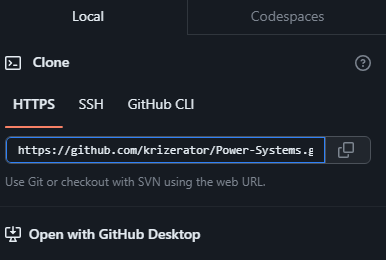

# Power-Systems

### Installation

Below are the instructions to set up the repository in your computer:

1. On top of [this page](https://github.com/krizerator/Power-Systems), click on the green  `<> Code` button.

2. Copy the URL of the repository.

3. Open Terminal.
4. Change the current working directory to the location where you want the cloned directory (i.e. `/mnt/c/Users/username/desktop/Power-Systems`.)
5. Type ``git clone``.